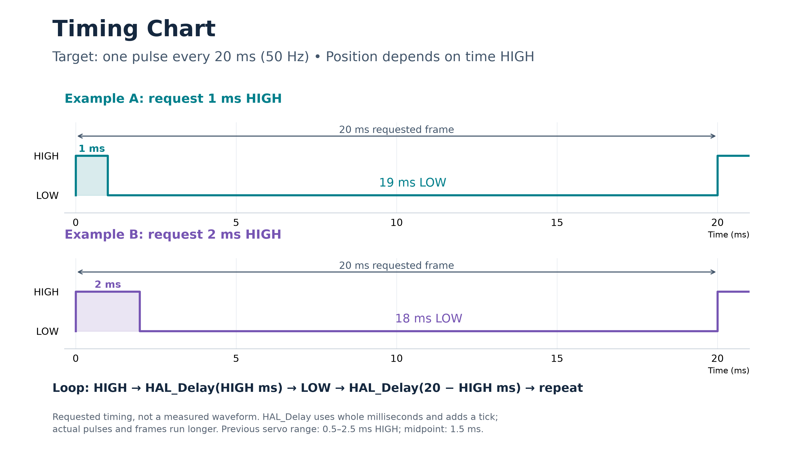

# Icebreaker

STM32G491 starter project with CubeMX peripheral initialization and an empty main loop.
The STM32 HAL/CMSIS, startup code, and existing board pin configuration are retained.
Custom device drivers, application threads, networking, telemetry, USB middleware,
and OTA/bootloader integration have been removed.

## Build

Install CMake 3.22+, Ninja, and the Arm GNU embedded toolchain on PATH, then run:

```sh
cmake --preset Debug
cmake --build --preset Debug
```

Use the Release presets for a release build. The output is
`build/Debug/Icebreaker.elf`. Flash the ELF with an STM32 programming tool.
The application starts at `0x08000000` and uses the full 512 KiB flash region.

Add application code in the user sections of `Core/Src/main.c`.
`icebreaker.ioc` retains the original board hardware configuration for CubeMX.

Alternatively, use the build and flash helper:

```sh
./build.py build --debug
./build.py build --release
./build.py flash --debug --method st-flash
```

The helper writes ELF and BIN files to `build/Debug_Script` or
`build/Release_Script` and flashes at `0x08000000` by default.

## Learning exercise: control a servo from main

Make a servo hold a position by turning a GPIO pin HIGH and LOW in a repeating
loop in `Core/Src/main.c`. Use the supplied `delay_us` helper to time the HIGH and
LOW parts in microseconds. You do not need to implement timer PWM, interrupt
handlers, or a separate servo driver file. The delay helper is implemented for
you; the servo loop is left for you to write.

### What signal does the servo need?

Repeat one pulse every **20 milliseconds** (50 pulses per second). The amount of
time the signal stays HIGH tells the servo which position to hold. Keep sending
pulses for as long as you want to command that position.

| Position | Time HIGH | Time LOW | Total period | Duty cycle |
| --- | --- | --- | --- | --- |
| 0° | 500 µs | 19,500 µs | 20,000 µs | 2.5% |
| 135° (midpoint) | 1,500 µs | 18,500 µs | 20,000 µs | 7.5% |
| 270° | 2,500 µs | 17,500 µs | 20,000 µs | 12.5% |

These are the settings used by the previous firmware, not independently verified
manufacturer specifications. Its angle range was 0–270° with a linear mapping
between 500 and 2,500 µs.

- 1 millisecond (ms) = 1,000 microseconds (µs).
- Time LOW = 20,000 µs − time HIGH.
- Duty cycle is the percentage of each period spent HIGH.
- A 20 ms LOW delay after the HIGH pulse would make the period too long: subtract
  the HIGH time from the period first.

### Choose and configure a pin

| Previous servo connection | MCU pin |
| --- | --- |
| Dump servo signal | PA0 |
| Normally-open (NO) servo signal | PA1 |

Choose one servo for the exercise. The existing project configures PA0 and PA1
as timer alternate-function pins. **Change your chosen pin to a normal push-pull
GPIO output, initially LOW**, before trying to toggle it. You can change this in
CubeMX or configure the GPIO in a user section of `main` after all generated
initialization calls. If configuring it in `main`, do so after `MX_TIM2_Init()`,
which otherwise restores the timer pin configuration. Do not start timer PWM.

Use `HAL_GPIO_WritePin` to set the output HIGH or LOW. The servo signal and board
need a shared ground; the GPIO is the control signal, not the servo's power supply.

### Suggested function

Keep the declaration and your implementation in user sections of
`Core/Src/main.c`. No extra source files or CMake changes are needed.
This is a prototype only:

```c
void servo_pulse(GPIO_TypeDef *port, uint16_t pin, uint32_t pulse_width_us);
```

| Parameter | Meaning | Example |
| --- | --- | --- |
| `port` | GPIO port containing the signal pin | `GPIOA` |
| `pin` | HAL pin mask, not a plain pin number | `GPIO_PIN_0` or `GPIO_PIN_1` |
| `pulse_width_us` | Requested HIGH time, 500–2,500 µs inclusive | `1500` requests the midpoint |

Have the function produce one HIGH/LOW cycle whose **requested delays total
20,000 µs**, then return. Clamp `pulse_width_us` to 500–2,500 before calculating
the LOW delay.
Assume the port and pin are valid and already configured. The function blocks
while generating its frame and does not report whether the servo has physically
reached a position. GPIO overhead and interrupts can extend the waveform; see the timing note below.

Call it repeatedly from the existing infinite loop in `main` to hold a position.
Alternatively, put the same sequence directly in that loop without a helper
function. A single call sends only one pulse; it does not maintain the signal.

### Supplied microsecond delay

`Core/Inc/delay.h` declares the helper implemented in `Core/Src/delay.c`:

```c
bool delay_init(void);
void delay_us(uint32_t microseconds);
```

The starter already includes the header and calls `delay_init()` after
`SystemClock_Config()`. It checks for failure and enters `Error_Handler` if the
CPU cycle counter cannot be used. You only need to call `delay_us` from your loop.
If you change the core clock later, call `delay_init()` again and check its result.
The helper requires a core clock that is a whole number of MHz; the existing
170 MHz configuration meets that requirement.

The parameter is a whole number of **microseconds**: `delay_us(500)` requests
0.5 ms, `delay_us(1500)` requests 1.5 ms, and `delay_us(20000)` requests 20 ms.
A zero delay returns immediately. Do not pass fractional values.

The helper counts CPU cycles using the Cortex-M4 DWT cycle counter. At 170 MHz,
one microsecond corresponds to 170 cycles. It handles counter wraparound and
splits very long requests to avoid arithmetic overflow. It does not configure a
timer peripheral, change the HAL tick, or disable interrupts. Leave the cycle
counter running and do not reset it while a delay is in progress.

### Set up the repeating loop

The target period is **20,000 µs from the start of one HIGH pulse to the start
of the next**. Divide it into a HIGH delay and a LOW delay:

**Requested LOW delay (µs) = 20,000 − requested HIGH delay (µs)**

| Requested HIGH delay | Requested LOW delay | Sum of requested delays | Nominal duty cycle |
| --- | --- | --- | --- |
| 500 µs | 19,500 µs | 20,000 µs | 2.5% |
| 1,500 µs | 18,500 µs | 20,000 µs | 7.5% |
| 2,500 µs | 17,500 µs | 20,000 µs | 12.5% |

Write these steps inside the existing infinite loop in `main`, or inside your
optional `servo_pulse` function called once per loop:

1. Choose a HIGH time between 500 and 2,500 microseconds.
2. Set the selected GPIO HIGH using `HAL_GPIO_WritePin`.
3. Call `delay_us` with the chosen HIGH time.
4. Set the GPIO LOW using `HAL_GPIO_WritePin`.
5. Call `delay_us` with **20,000 minus the chosen HIGH time**.
6. Repeat immediately. Do not add another delay after the frame.

A 20,000 µs LOW delay plus a 1,500 µs HIGH delay would request a 21,500 µs period.
Subtract the HIGH time first. Keep other work out of the loop while checking the
waveform, since it adds time between pulses.

### HAL_Delay and timing accuracy

`HAL_Delay(uint32_t Delay)` remains available for ordinary waits in **milliseconds**.
For example, `HAL_Delay(1000)` requests about one second. It uses the existing
TIM6-backed HAL tick, so leave interrupts enabled and do not suspend that tick.

Use `delay_us` for both parts of the servo frame. `HAL_Delay` accepts only whole
milliseconds and adds a tick to guarantee a minimum wait; it cannot request a
1,500 µs pulse accurately. Do not replace or modify the HAL implementation.

The cycle-counter helper provides microsecond-resolution minimum waits, not a
hard guarantee of exact GPIO edge timing. Function calls, GPIO writes, loop
instructions, and interrupts can extend the pulse or period. It blocks the CPU
while waiting, and debugger pauses invalidate waveform measurements. Check the
output on real hardware without breakpoints. If exact edges under interrupt load
are needed later, hardware PWM is the next step beyond this exercise.

### Optional angle conversion

The old driver used **pulse width (µs) = 500 + angle × 2,000 ÷ 270**.
Clamp the absolute angle to 0–270°, use at least 32-bit arithmetic for the
multiplication, and truncate fractional microseconds. You can do this calculation
in `main`; no angle-conversion implementation is supplied.

### Previous valve positions (optional reference)

These pulse widths can be requested with `delay_us`.
You do not need them to complete the exercise. They were calibrated for the old
valve linkage and are not generic open/closed positions for every installation.

| Servo / state | Absolute angle | HIGH time | LOW time | Duty cycle |
| --- | --- | --- | --- | --- |
| NO open | 4° | 529 µs | 19,471 µs | 2.645% |
| NO closed | 94° | 1,196 µs | 18,804 µs | 5.980% |
| Dump open | 5° | 537 µs | 19,463 µs | 2.685% |
| Dump closed | 92° | 1,181 µs | 18,819 µs | 5.905% |

### Build and check

1. Write your loop or functions in the user sections of `Core/Src/main.c`.
2. Build with `./build.py build --debug` and flash using your board's programmer.
3. Start with 1,500 µs HIGH and 18,500 µs LOW. Measure the selected pin with an
   oscilloscope or logic analyzer: target a 1.5 ms HIGH pulse and a 20 ms period.
4. Check 500 and 2,500 µs requests and their complementary LOW delays. Verify
   pulse widths and periods in both Debug and Release builds.
5. Try an out-of-range argument and confirm that your servo function clamps it
   to 500–2,500 µs before calculating the remainder.

### Timing Chart



Download the [PNG](docs/servo-timing.png) for PowerPoint or the
[SVG](docs/servo-timing.svg) for scalable graphics. The chart uses a 16:9 layout
and shows target timing; GPIO overhead and interrupts can extend the measured waveform.
